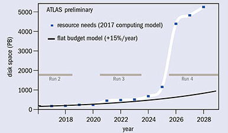
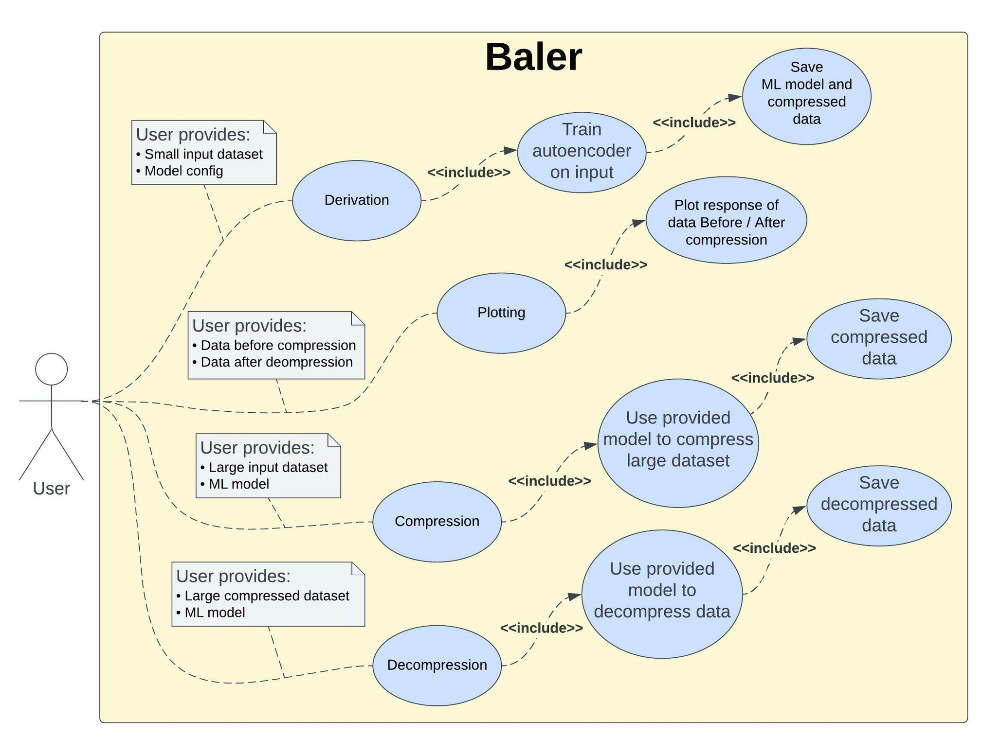

# Introduction

## Background
Many fields in research and industry struggle with having too much data and too little storage. At Large Hadron Collider experiments like ATLAS, the disk space needed in 5 years is 10 times more than the projected available disk space with projected funding and technology trends.

Data formats used in big data fields are already very optimized for storage. The ROOT data format used in particle physics does not compress under normal loss-less compression methods like zip. Luckily, the observable in particle physics are often statistical variables, where the number of observed events is key to finding new physics.

Since loss-less compression doesn’t provide more storage, and  the observable benefit from more events, lossy compression is a good alternative. Using lossy compression some data accuracy will be lost, but the compression will allow for more events to be stored which will increase the statistical precision.

## Product goals
Baler aims to be a tool which will use lossy machine learning based compression methods to compress multi-dimensional data and evaluate the accuracy of the compressed data. The compression “algorithm” is derived by training an auto-encoder to compress and decompress multidimensional data.

Baler will support 4 running modes:
- Training: An autoencoder is trained on smaller input data, the original, compressed, and decompressed data is saved as a .csv file together with the compression and decompression model.
- Plotting: Plotting of the performance (response, mean square etc) of user defined data variables will be shown to determine the accuracy of the decompression.
- Compressing: A larger original dataset can be compressed with a model derived from an earlier smaller dataset.
- Decompressing. Decompressing of compressed data using the model which originally compressed the data.

After phase 1, baler will be a collection of python modules and a run script, where the running parameters is defined by a user configuration file. It will not be deliered as a complete python pacakge. Phase 1 will only have native support for .root and .csv file formats. 

## System user
The large demand for this kind of compression has been expressed form multiple researchers outside of particle physics, and baler therefore  aims to make baler compatible with multiple different types of data, and easy to use. In its first phase, baler is aimed towards other researchers, and some deeper understanding of data science and python is assumed.

# System Use Case Diagram

# Success Metrics
This section outlines the goals and associated metrics of Baler

### Support compression of different scientific data
Baler will work out of the box on CMS/ATLAS .root data, CFD .HDF5 data, and astrophysics .csv catalogues. This without changing the core code, only by specifying a different config file

### Meaningful performance evaluation
Baler will, together with derivation of ML model, produce meaningful plots and values to define the uncertainty added to de-compressed data due to the compression process.

### Ease of use
Baler will be easy to use by fellow researchers with some previous python experience, but no machine learning experience. This goal will be validated by perforing user testing amongst colleagues.

# Requirements
This section contains all the technological, functional and non-functional requirements of the system.

## Technological requirements
This section outlines the non-functional Technological
### Containerization
**Description:** Baler will require a working Docker installation to run.\
**Reason:** In order to run Baler in multiple different user environements and hardware, Baler will be containerized using docker.

## Functional requirements
This section outlines the functional requirements
### Model derivation
**Description:** Given an input file and a configuration (Including model structure) file Baler will derive the model weights and evaluate uncertainty/performance of compression\
**Reason:** Core functionality

## Non-functional requirements
This section outlines the non-functional requirements
### Execution speed < 1 min
**Description:** The execution of baler using a minimalistic dataset should be less than 1 minute.\
**Reason:** Execution speed of the code sshould be high. A minimal dataset is used as metric in order to exclude training time from this metric

# User Interaction and Design
Derivation of model weights and erros is done by supplying dataset and config using:\
`python3 run.py --config=projects/cms/configs/cms.json --input=projects/cms/data/cms_data.root --output=projects/cms/output/ --mode=train`

Compression, supplying model with weights and input, using:\
`python3 run.py --config=projects/cms/configs/cms.json --input=projects/cms/data/cms_data.root --output=projects/cms/output/ --mode=compress`

De-compression, supplying model with weights and input, using:\
`python3 run.py --config=projects/cms/configs/cms.json --input=projects/cms/data/cms_data.bal --output=projects/cms/output/ --mode=decompress`
